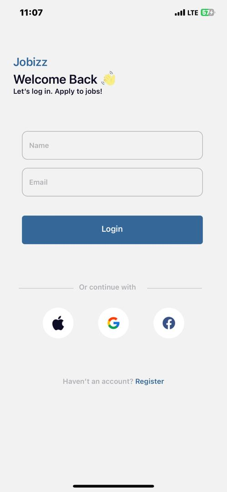
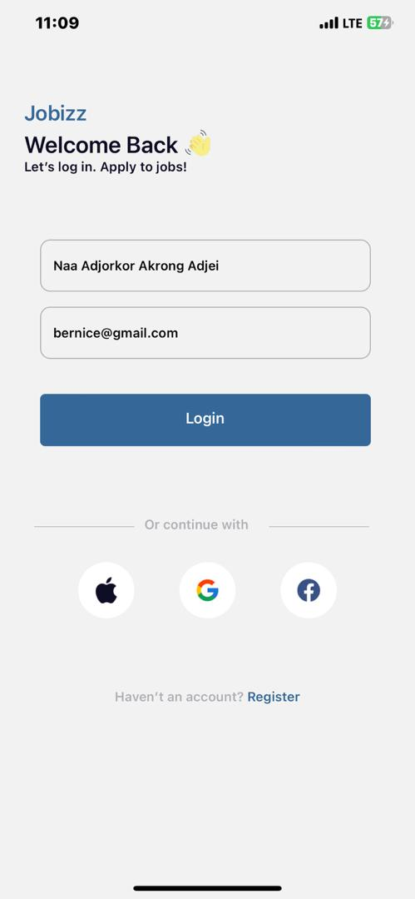
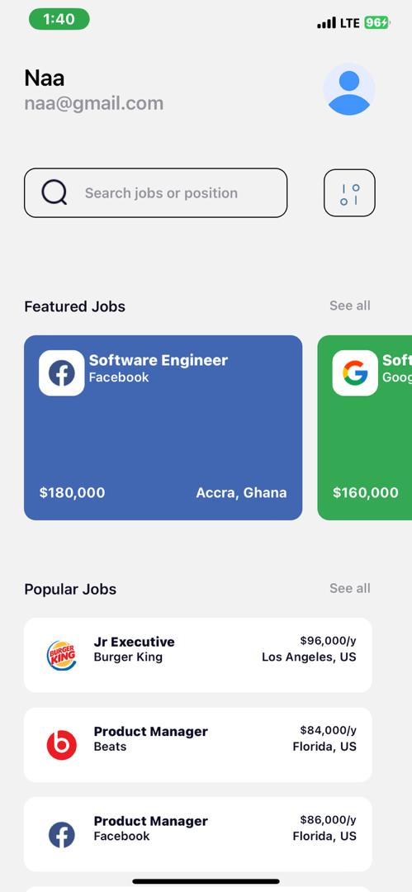
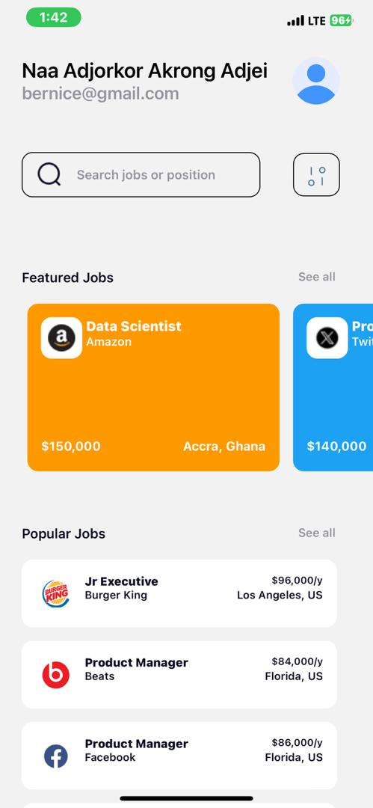

# rn-assignment4-11333063

## Project Description
This project is a mobile application developed using React Native and Expo.The app replicates the design provided in the UI mockup and includes core components and custom components (Jobizz)

## Components usage
1. App.js 
- This is the main entry point of the application. This is where the other components are set-up.
- Combines all components.

2. LoginScreen.jsx
Provides a UI for users to login to the application.

3. HomeScreen.jsx
- Displays a list of job postings.
- Each job posting includes the job title, company name, salary and location.

4. JobCard.jsx
- A custom component that displays a featured job posting.
- Includes the job title, company name,image, salary and location.

5. PopularCard.jsx
- A custom component that displays a popular job posting.
- Includes the job title, company name, salary and location.
- Has a different design compared to the JobCard component.

6. featureJobs.js
- A data file that contains an array of featured job postings.
- Each job posting includes the job title, company name, image, salary and location.
- Used in the HomeScreen component.

7. popularJobs.js
- A data file that contains an array of popular job postings.
- Each job posting includes the job title, company name, salary and location.
- Used in the HomeScreen component.

8. ../assets/images
- Contains images used in the application.
- Used in the JobCard component.
- Used in the PopularCard component.
- Used in the HomeScreen component.
- Used in the LoginScreen component.

## Screenshots
1. Login Screen

2. HomeScreen

.jpg)

# Akrong Adjei Naa Adjorkor